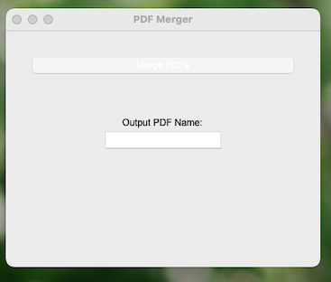
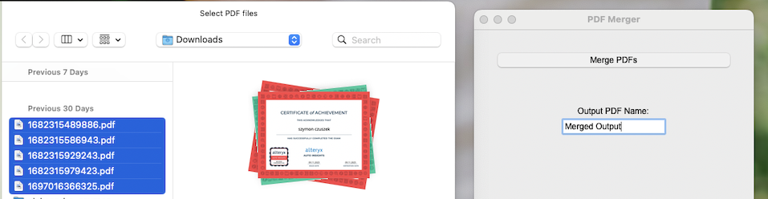
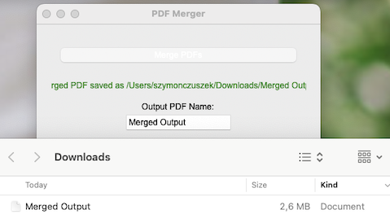

# 📚 PDF-Tool-Kit

## 🔓 PDF Decrypter

This Python script provides a simple Graphical User Interface (GUI) to decrypt multiple PDF files.

## 🔗 PDF Merger

This Python script provides a simple Graphical User Interface (GUI) to merge multiple PDF files into a single PDF document.

**⚙️ Prerequisites:**

- 🐍 Python 3.x
- 📦 Required Python packages: PyPDF2, tkinter

**📥 Installation:**

1. 📁 Clone or download the repository to your local machine.
2. 💻 Install the necessary Python packages if you haven't already:

```terminal
pip install PyPDF2
pip install tkinter
```

**🚀 Run the script:**

```terminal
python Merge_PDF.py
```
A GUI window will appear. Click the "Merge PDFs" button.
<br>  <br>
Select the PDF files you want to merge using the file dialog.
<br>  <br>
Choose the destination folder where the merged PDF will be saved. Optionally, specify the name for the output PDF.
<br>  <br>
Click "Save" or "OK" to complete the merging process.

**📝 Notes:**

If no output PDF name is provided, the default name will be set as merged.pdf.
Any error during the merging process will be displayed in the result section of the GUI.

**Contributing:**

Contributions are welcome! If you find any issues or have suggestions for improvements, feel free to open an issue or create a pull request.

**License:**

This project is licensed under the MIT License.
